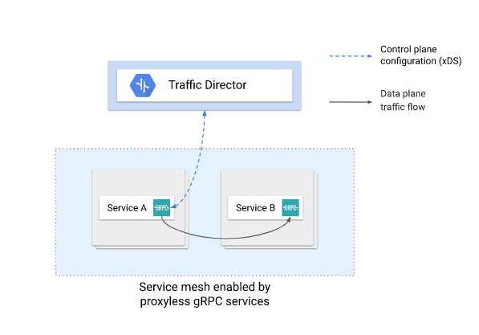
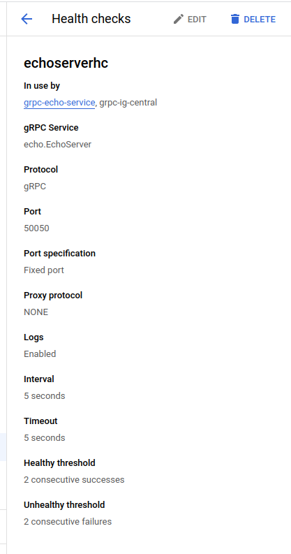
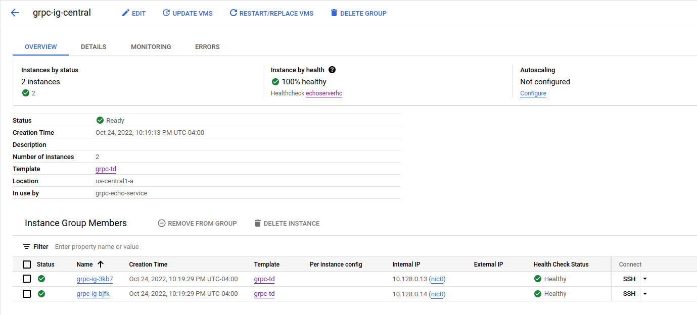
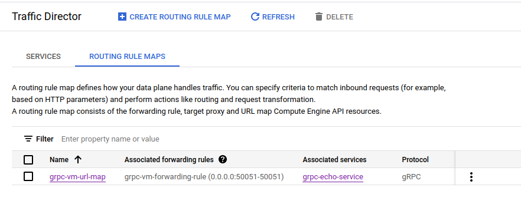
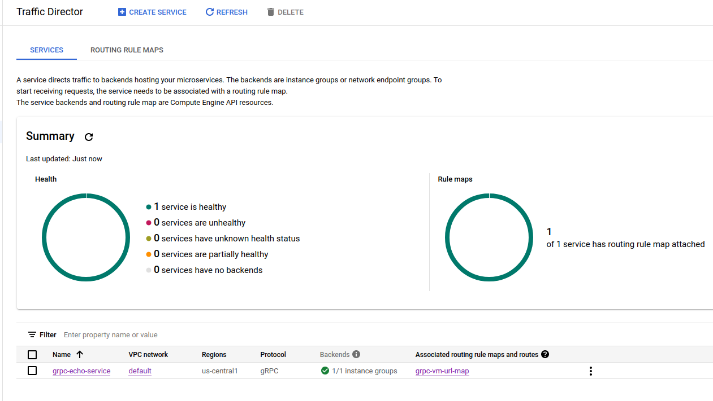

### Proxyless gRPC with Google Traffic Director

This is just my version of setting up [proxyless gRPC using Google Traffic Director](https://cloud.google.com/traffic-director/docs/proxyless-overview) on GCE VMs (not GKE)

While you can just follow their official [setup guide](https://cloud.google.com/traffic-director/docs/security-proxyless-setup), i found that to be just exhaustingly complex.

Instead, this tutorial just focuses on the basics

This document will not go into how Traffic Director or proxyless gRPC works but for a pure grpc xDS sample without Traffic Director, see:

* [gRPC xDS Loadbalancing](https://github.com/salrashid123/grpc_xds)



(image taken from official google docs)

---

## Setup

Before we dive into the setup, a bit about the application w'ere deploying


The gRPC application doens't do anything really and just echo's back some data

```proto
syntax = "proto3";

package echo;
option go_package = "github.com/salrashid123/go-grpc-td/echo";

service EchoServer {
  rpc SayHelloUnary (EchoRequest) returns (EchoReply) {}
}

message EchoRequest {
  string name = 1;
}

message EchoReply {
  string message = 1;
}
```

The client->server traffic is using over TLS and on port `:50051` using a custom CA and certs with SNI (on the server) of `grpc.domain.com`.

Note that at the moment GCP gRPC healthchecks _does NOT support TLS health checks_ (see [grpc healthcheck criteria](https://cloud.google.com/load-balancing/docs/health-check-concepts#criteria-protocol-grpc))...which is really unusual and I hope it'll get addressed.

In the meantime, the gRPC server we will deploy will listen for [gRPC HealthChecks](https://github.com/grpc/grpc/blob/master/doc/health-checking.md) on port `:50050` which does not use TLS


Anyway, to continue, you'll need a GCP project and pretty wide admin permissions


```bash
# set some env vars
export PROJECT_ID=`gcloud config get-value core/project`
export PROJECT_NUMBER=`gcloud projects describe $PROJECT_ID --format='value(projectNumber)'`

# enable services; we will save the image we build on artifact registry
gcloud services enable  \
     artifactregistry.googleapis.com  \
     iam.googleapis.com trafficdirector.googleapis.com compute.googleapis.com

# create a registry and allow the default svc account for the servers to pull and run the image
gcloud artifacts repositories create ar1 --repository-format=docker --location=us-central1

gcloud artifacts repositories add-iam-policy-binding ar1 --location=us-central1  \
    --member=serviceAccount:$PROJECT_NUMBER-compute@developer.gserviceaccount.com  \
     --role=roles/artifactregistry.reader

# allow the grpc clients to acquire routing data from the traffic director api
gcloud projects add-iam-policy-binding $PROJECT_ID \
    --member serviceAccount:$PROJECT_NUMBER-compute@developer.gserviceaccount.com \
    --role=roles/trafficdirector.client

# build and acquire the image's hash
docker build -t us-central1-docker.pkg.dev/$PROJECT_ID/ar1/xds-td .
docker push us-central1-docker.pkg.dev/$PROJECT_ID/ar1/xds-td
docker pull us-central1-docker.pkg.dev/$PROJECT_ID/ar1/xds-td

export IMAGE=`docker inspect us-central1-docker.pkg.dev/$PROJECT_ID/ar1/xds-td | jq -r '.[].RepoDigests[0]'`
echo $IMAGE
```

We're now ready to do the rest of the deployment


### Server

```bash
# create an egress NAT for outbound traffic (we won't allow the grpc Servers to have external addresses)
gcloud compute addresses create natip --region=us-central1

gcloud compute routers create router \
    --network default \
    --region us-central1

gcloud compute routers nats create nat-all \
  --router=router --region=us-central1 \
  --nat-external-ip-pool=natip  \
  --nat-all-subnet-ip-ranges 

# create a healthcheck on port 50050
gcloud compute health-checks create grpc echoserverhc  --grpc-service-name echo.EchoServer --port 50050 --enable-logging

# create an instance template specifying the image we built
gcloud compute  instance-templates create-with-container grpc-td --machine-type=g1-small --no-address  \
   --tags=grpc-td --image=cos-stable-101-17162-40-13 --image-project=cos-cloud \
     --container-image=$IMAGE \
     --scopes=https://www.googleapis.com/auth/cloud-platform  --service-account=$PROJECT_NUMBER-compute@developer.gserviceaccount.com  \
     --container-restart-policy=always --labels=container-vm=cos-stable-101-17162-40-13

# create an instance group; we're using us-central1-a here but you can repeat the sequence for N zones
gcloud compute  instance-groups managed create grpc-ig-central \
     --base-instance-name=grpc-ig --template=grpc-td \
     --size=2 --zone=us-central1-a \
     --health-check=echoserverhc \
     --initial-delay=300

gcloud compute instance-groups set-named-ports grpc-ig-central  \
  --named-ports=grpc-echo-port:50051 \
  --zone us-central1-a

# allow the grpc healthcheck to access the server over port 50050
gcloud compute firewall-rules create grpc-vm-allow-health-checks \
   --network default --action allow --direction INGRESS \
   --source-ranges 35.191.0.0/16,130.211.0.0/22  \
   --target-tags grpc-td \
   --rules tcp:50050
 
# create a backend service
gcloud  compute backend-services create grpc-echo-service \
    --global \
    --load-balancing-scheme=INTERNAL_SELF_MANAGED \
    --protocol=GRPC \
    --port-name=grpc-echo-port \
    --health-checks echoserverhc

# add the instance group for the N zones we defined
gcloud compute backend-services add-backend grpc-echo-service \
  --instance-group grpc-ig-central \
  --instance-group-zone us-central1-a \
  --global

# create a urlmap of the backens and hosts.  Make sure the $PROJECT_ID value is set on the environment
gcloud compute url-maps import grpc-vm-url-map << EOF                                                                                            
name: grpc-vm-url-map
defaultService: projects/$PROJECT_ID/global/backendServices/grpc-echo-service
hostRules:
- hosts:
  - grpc.domain.com:50051
  pathMatcher:  grpc-vm-path-matcher
pathMatchers:
- name:  grpc-vm-path-matcher
  defaultService: projects/$PROJECT_ID/global/backendServices/grpc-echo-service
  routeRules:
  - priority: 0
    routeAction:
      weightedBackendServices:
      - backendService: projects/$PROJECT_ID/global/backendServices/grpc-echo-service
        weight: 100
EOF

# create a target proxy thats setup for proxyless
gcloud compute target-grpc-proxies create grpc-vm-proxy  --url-map grpc-vm-url-map  --validate-for-proxyless

# finally a forwarding rule over the actual TLS port of 50051.
gcloud compute forwarding-rules create grpc-vm-forwarding-rule \
 --global \
 --load-balancing-scheme=INTERNAL_SELF_MANAGED \
 --address=0.0.0.0 --address-region=us-central1 \
 --target-grpc-proxy=grpc-vm-proxy \
 --ports 50051 \
 --network default
```

At the end, you should have 

- Healthcheck



- Instance Group with two VMs



- Routing Rules



- Traffic Director with runnings service endpoint of `grpc-echo-service`



### Client

For a client, we need to create a VM and run our sample there

```bash
 gcloud compute instances create xds-client      --image-family=debian-10  \
      --image-project=debian-cloud    \
      --scopes=https://www.googleapis.com/auth/cloud-platform  --service-account=$PROJECT_NUMBER-compute@developer.gserviceaccount.com  
```

in my case the instances we have now are
```bash
$ gcloud compute instances list
    NAME          ZONE           MACHINE_TYPE   PREEMPTIBLE  INTERNAL_IP  EXTERNAL_IP    STATUS
    grpc-ig-3kb7  us-central1-a  g1-small                    10.128.0.13                 RUNNING
    grpc-ig-bjfk  us-central1-a  g1-small                    10.128.0.14                 RUNNING
    xds-client    us-central1-a  n1-standard-1               10.128.0.15  34.170.28.112  RUNNING
```

Now create a bootstrap config file (again make sure the file has the `$PROJECT_NUMBER` populated)

- `xds_bootstrap.json`

```json
cat <<EOF > xds_bootstrap.json
{
  "xds_servers": [
    {
      "server_uri": "trafficdirector.googleapis.com:443",
      "channel_creds": [
        {
          "type": "google_default"
        }
      ],
      "server_features": [
        "xds_v3"
      ]
    }
  ],
  "node": {
    "id": "projects/$PROJECT_NUMBER/networks/default/nodes/6d92e8e9-439b-454d-9500-b8ef02fc3553",
    "metadata": {
      "TRAFFICDIRECTOR_NETWORK_NAME": "default"
    },
    "locality": {
      "zone": "us-central1-a"
    }
  }
}
EOF
```

copy `xds_bootstrap.json` to the client

```bash
gcloud compute scp xds_bootstrap.json xds-client:/tmp/
```

SSH to the client

```bash
gcloud compute ssh xds-client

sudo su -
apt-get install git wget

# install golang
wget https://go.dev/dl/go1.19.2.linux-amd64.tar.gz
rm -rf /usr/local/go && tar -C /usr/local -xzf go1.19.2.linux-amd64.tar.gz
export PATH=$PATH:/usr/local/go/bin

git clone https://github.com/salrashid123/grpc_xds_traffic_director.git
cd grpc_xds_traffic_director/
```

First test with DNS resolution (note, the hostname for one of the servers will be different for you)

```bash
go run client/grpc_client.go --host dns:///grpc-ig-3kb7:50051 
  2022/10/25 02:25:01 Unary Request Response:  SayHelloUnary Response 3a81e3ae-540c-11ed-9ed0-42010a80000d

go run client/grpc_client.go --host dns:///grpc-ig-bjfk:50051 
  2022/10/25 02:25:32 Unary Request Response:  SayHelloUnary Response 4d106659-540c-11ed-bfec-42010a80000e
```

Not test with the GRPC servers


```bash
export GRPC_XDS_BOOTSTRAP=/tmp/xds_bootstrap.json

# for verbose logging (its a lot)
# export GRPC_GO_LOG_VERBOSITY_LEVEL=99
# export GRPC_GO_LOG_SEVERITY_LEVEL=info
# export GODEBUG=http2debug=2
# export GRPC_VERBOSITY=DEBUG

go run client/grpc_client.go --host xds:///grpc.domain.com:50051
  2022/10/25 02:26:02 Unary Request Response:  SayHelloUnary Response 5e92d765-540c-11ed-bfec-42010a80000e

go run client/grpc_client.go --host xds:///grpc.domain.com:50051
  2022/10/25 02:26:05 Unary Request Response:  SayHelloUnary Response 60c3f327-540c-11ed-bfec-42010a80000e

go run client/grpc_client.go --host xds:///grpc.domain.com:50051
  2022/10/25 02:26:08 Unary Request Response:  SayHelloUnary Response 624cebe9-540c-11ed-9ed0-42010a80000d

go run client/grpc_client.go --host xds:///grpc.domain.com:50051
  2022/10/25 02:26:13 Unary Request Response:  SayHelloUnary Response 653d3fa6-540c-11ed-9ed0-42010a80000d

```

Note that the responses above were from both servers and we did not setup a proxy at all...traffic director sent down the list of active servers


If you really want to see the debug logs, see

* [xds verbose logs](https://gist.github.com/salrashid123/36737000bc71b4f4fba8d5d0067dbabb)
* [dns verbose logs](https://gist.github.com/salrashid123/67be14de3998c75e78bd08fd693f7568)
----


### Cleanup

to unwind,

```bash
gcloud compute forwarding-rules delete grpc-vm-forwarding-rule --global -q

gcloud compute target-grpc-proxies delete grpc-vm-proxy  -q

gcloud compute url-maps delete grpc-vm-url-map  -q

gcloud  compute backend-services delete  grpc-echo-service --global -q

gcloud compute  instance-groups managed delete grpc-ig-central -q

gcloud compute  instance-templates delete grpc-td  -q
```